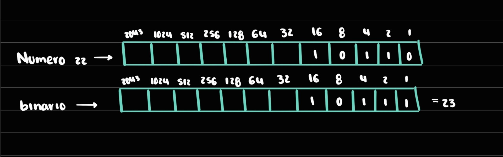
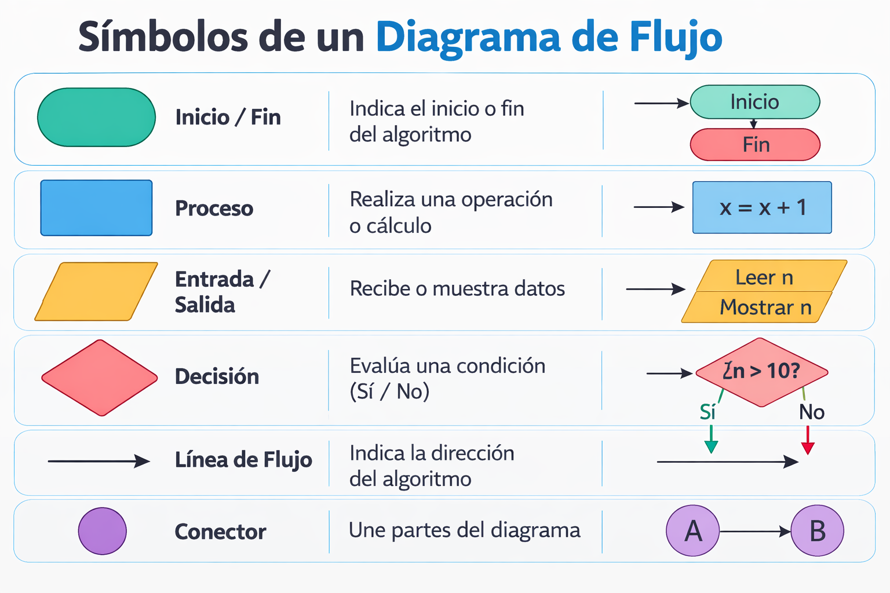

# ACTIVIDAD 1
1. Convierte el número decimal 22 a binario.

*DECIMAL Y BINARIO*



Respuesta: 
**LETRA Y**

>2. ¿Cuál es el resultado en decimal del número binario 10110?

El número binario 10110₂ = 22₁₀ en decimal.

>3. ¿Qué número binario representa el carácter 'C' en ASCII?

'C' en el estándar ASCII tiene el valor 67 en decimal y se conbierte a binario
'C' = 01000011

>4. Convierte el número flotante 5.75 a binario (explica los pasos).

Para convertir el número 5.75 a binario, lo más fácil es separar el número en dos partes: la parte entera (5) y la parte decimal (0.75).

Primero convertimos la parte entera (5). Para hacerlo, dividimos el número entre 2 varias veces y anotamos los residuos.
5 dividido entre 2 da 2 y sobra 1. Luego 2 dividido entre 2 da 1 y sobra 0. Finalmente 1 dividido entre 2 da 0 y sobra 1. Si leemos los residuos de abajo hacia arriba, obtenemos 101, por lo que 5 en decimal es 101 en binario.

Después convertimos la parte decimal (0.75). En este caso se multiplica la parte decimal por 2 y se toma la parte entera del resultado.
Primero, 0.75 × 2 = 1.50, entonces el primer número binario después del punto es 1 y seguimos con 0.50.
Luego, 0.50 × 2 = 1.00, así que el siguiente número es 1 y el proceso termina porque ya no queda parte decimal.

Al final solo juntamos las dos partes: la parte entera 101 y la parte decimal .11.

Por lo tanto, 5.75 en decimal es igual a 101.11 en binario.

>5. ¿Cuántos bytes se necesitan para almacenar la palabra “Hola” en ASCII?

La palabra “Hola” tiene 4 caracteres:

H  
o  
l  
a  

Como cada carácter ocupa 1 byte, entonces para almacenar la palabra “Hola” en ASCII se necesitan 4 bytes (equivalentes a 32 bits).

>6. ¿Cuántos bits hay en 5 KB?

como **1 byte = 8 bits** y **1 KB (kilobyte) = 1000 bytes** 
Entonces:

5 KB = 5 × 1000 bytes = 5000 bytes

5000 bytes × 8 bits = 40 000 bits


>7. Convierte el número decimal 255 a hexadecimal.

Para convertir 255 (decimal) a hexadecimal, dividimos el número entre 16, porque el sistema hexadecimal usa base 16.

**255÷16=15 con residuo 15**

En hexadecimal: 15 = F

>8. ¿Cuál es el valor hexadecimal de la secuencia binaria 11010110?

Para convertir de binario a hexadecimal, se agrupan los bits de 4 en 4 desde la derecha.

11010110

Separamos:

1101
0110

Ahora convertimos cada grupo:

1101₂ = 13₁₀ = D₁₆

0110₂ = 6₁₀ = 6₁₆

**D6**

### EJERCICO FINAL DE REPASO 

>1. Explica, en tus propias palabras, por qué es necesario que las computadoras representen los datos en binario.


>2. Convierte el número binario 10011011 a decimal y a hexadecimal.


>3. Investiga y describe cómo se representa una imagen en formato PNG en el disco.

Una imagen en formato Portable Network Graphics se guarda como una secuencia de bytes organizada en bloques llamados "chunks".

La estructura básica es:

Firma del archivo
Los primeros bytes identifican que el archivo es PNG.

Chunks (bloques de información)
Cada chunk contiene un tipo específico de datos, por ejemplo:

IHDR → información básica de la imagen (ancho, alto, profundidad de color).

IDAT → datos de los píxeles comprimidos.

IEND → indica el final del archivo.

Compresión
Los datos de los píxeles normalmente se comprimen usando el algoritmo DEFLATE, lo que reduce el tamaño del archivo sin perder calidad.

En resumen, una imagen PNG no se guarda como “puntos de colores” directamente, sino como datos binarios organizados que describen los píxeles y su color, junto con información de compresión y estructura del archivo.


>4. Analiza la siguiente situación: ¿Qué sucede si intentas almacenar un número mayor al que puede representar un byte (por ejemplo, 300)? ¿Cómo lo maneja Python?

Un byte puede representar 256 valores diferentes, es decir números desde 0 hasta 255. Por eso, un número como 300 no cabe dentro de un solo byte.

Por ejemplo, si solo se pudiera usar un byte:

300 − 256 = 44

Entonces el valor que realmente se almacenaría sería 44.

Sin embargo, en Python esto no ocurre. Python maneja los números enteros de forma dinámica, lo que significa que puede usar más memoria automáticamente cuando el número es más grande.


# ACTIVIDAD 2

>EJERCICIO 1




>*EJERCICIO 2*

**DATOS DE ENTRADA**
|NOMBRE  |DESCRIPCION |
|------|----------------|
| ID  |  AIIdentificador del empleado || S1, S2 , S3 , S4 ,S5 , S6  |  |
| |  |

**DATOS DE SALIDA**
|NOMBRE  |DESCRIPCION |
|------|----------------|
| ID  |  AIIdentificador del empleado |
| S1, S2 , S3 , S4 ,S5 , S6  |  |
| |  |


**PROCEDIMIENTOS**

TOTAL = S1 + S2 + S3 + S4 + S5 + S6
PROM = Total / 6

**PSEUDOCODIGO**

Inicio 
Leer ID, S1, S2 , S3 , S4 ,S5 , S6

Total =  S1 + S2 + S3 + S4 + S5 + S6

Prom = Total / 6
Mostrar ID,Total,Prom

Fin


**OPERADORES RELACIONALES**
|   |       |
|------|----------------|
| Igial a | = |
| Mayor que  | > |
| Meyor o igual|>=  |
|Menor que |<|
|Menor o igual que |<=|


>**EJERCICIOS DE REPASO**
1. Un acuario necesita determinar cuantos litros de agua caben en un acuario , pero solo dispone de una cinta metrica. Diseña un algoritmo

**DATOS DE ENTRADA**
|NOMBRE  |DESCRIPCION |
|------|----------------|
| Largo  | Largo del tanque en CM  |
| Ancho  | Ancho del tanque en CM  |
| Alto|Alto del tanque en CM  |
|Unidad de salida | Unidad de medida (litro o galon) de volumen total|

 **DATOS DE SALIDA**
 |NOMBRE  |DESCRIPCION |
|------|----------------|
|Volumen lt | Volumen del tanque en litros  |
| Volumen gal  | Volumen del tanque en galones |


```
INICIO

    ESCRIBIR "Ingrese el largo del acuario en centimetros:"
    LEER largo

    ESCRIBIR "Ingrese el ancho del acuario en centimetros:"
    LEER ancho

    ESCRIBIR "Ingrese el alto del acuario en centimetros:"
    LEER alto

    volumen = largo * ancho * alto

    ESCRIBIR "Seleccione la unidad del resultado:"
    ESCRIBIR "1. Litros"
    ESCRIBIR "2. Galones"
    LEER opcion

    SI opcion = 1 ENTONCES
        resultado = volumen_cm3 / 1000
        ESCRIBIR "El acuario tiene capacidad de " resultado " litros"
    SINO
        resultado = volumen_cm3 / 3785
        ESCRIBIR "El acuario tiene capacidad de " resultado " galones"
    FIN SI

FIN
```


2. Realice un algoritmo para determinar cuánto se debe pagar por equis cantidad de lápices considerando que si son 1000 o más el costo es de $85 cada uno; de lo contrario, el precio es de $90. Represéntelo con el pseudocódigo y el diagrama de flujo.

**DATOS DE ENTRADA**
|NOMBRE  |DESCRIPCION |
|------|----------------|
| Lapices  | Cantidad de lapices  |

**DATOS DE SALIDA**
|NOMBRE  |DESCRIPCION |
|------|----------------|
| Total  | total que se cobro dependiendo de la cantidad  |


```
INICIO
	ESCRIBIR "Ingrese la cantidad de lápices "
	LEER cantidad

	SI cantidad >= 1000 ENTONCES
	   Total = cantidad * 85

	SINO 
	    Total = cantidad * 90
	FIN SI
	
	ESCRIBIR "el total a pagar es:" Total
FIN
```


3. Un almacén de ropa tiene una promoción: por compras superiores a $250 000 se les aplicará un descuento de 15%, de caso contrario, sólo se aplicará un 8% de descuento. Realice un algoritmo para determinar el precio final que debe pagar una persona por comprar en dicho almacén y de cuánto es el descuento que obtendrá. Represéntelo mediante el pseudocódigo y el diagrama de flujo.

```
INICIO 
	Escribir "ingrese el valor de la compra
        LEER valor

	SI cantidad > 250000 ENTONCES
	   Descuento = valor * 0.15

	SINO 
	    Total = valor * 0.08
	FIN SI
	
	PrecioFinal = valor - Descuento

	ESCRIBIR "El descuento aplicado es:" Descuento
	ESCRIBIR "El total a pagar es: " PrecioFinal
FIN
```

 
4. El director de una escuela está organizando un viaje de estudios, y requiere determinar cuánto debe cobrar a cada alumno y cuánto debe pagar a la compañía de viajes por el servicio. La forma de cobrar es la siguiente: si son 100 alumnos o más, el costo por cada alumno es de $65.00; de 50 a 99 alumnos, el costo es de $70.00, de 30 a 49, de $95.00, y si son menos de 30, el costo de la renta del autobús es de $4000.00, sin importar el número de alumnos.
```
INICIO
	ESCRIBIR "Ingrese la cantidad de estudiantes que van a viaje"
	LEER cantidad

	SI cantidad >= 100 ENTONCES
	precio = 65
	Total = cantidad * precio

	SINO
	    SI cantidad >= 50 ENTONCES
 	    precio = 70
	    Total = cantidad * precio
	
		SINO
		    SI cantidad >=30 ENTONCES
		    precio = 95
		    Total = cantidad * precio
		
			SINO
			    Total = 4000
			    precio = Total / cantidad
			FIN SI
		FIN SI
	FIN SI

	ESCRIBIR "Cada alumno debe pagar: $", precio
	ESCRIBIR "El total que se paga a la compañia es: $", Total
FIN

```


>**EJERCICIO BUCLES Y CICLOS**

```
Inicio 
SU = 0 
VA = 0
Mientras VA != -1
    Leer VA 
    SU = SU + VA
Fin mientras 
Escribir SU 
Fin
```
**1. Identificar Algoritmos**

Responde si los siguientes enunciados representan un algoritmo. Justifica la respuesta:

1. Una página web. ❌  
2. Una receta para hacer un pastel, donde se indican ingredientes y pasos a seguir. ✅
3. "Piensa en un número y multiplícalo por otro". ❌
4. Un manual de instrucciones para armar un mueble, con pasos detallados y un orden claro. ✅
5. Una lista de compras organizada en orden alfabético ❌

**Parte 2: Variables y Constantes**

Indica si las siguientes afirmaciones describen una variable o una constante:

1. El valor de la gravedad en la Tierra, 9.8 m/s². **(constante)**

2. La edad de una persona calculada con base en el año actual y su año de nacimiento.**(variable)**

3. La cantidad de dinero en una cuenta bancaria.**(variable)**

4. La velocidad de la luz en el vacío, 299,792,458 m/s.**(constante)**

5. El radio de un círculo.**(variable)**


**Parte 3: Características de los Algoritmos**

1. Elegir la ruta más corta y detenerse cuando los cambios parecen pequeños.
❌ No cumple completamente.
Porque la condición “cuando los cambios parecen lo suficientemente pequeños” no es precisa.

2. Suma los números ingresados y muestra el resultado.
❌ No cumple completamente.
No indica cuántos números ni cómo se ingresan, por lo que no es suficientemente preciso.

3. Un conjunto de pasos para calcular el área de un rectángulo dado su base y altura.
✅ Sí cumple.
Es un procedimiento claro, definido y finito.

4. El algoritmo cuenta el número de votos obtenidos por cada uno de los candidatos de una elección para presidente. Empieza solicitando el nombre del candidato y finaliza cuando se ingresa el valor -1.
✅ Sí cumple.

Tiene:
- inicio
- pasos claros
- condición de finalización (-1).


***Parte 4: Comprensión de Herramientas**


1. El pseudocódigo utiliza símbolos estándar para representar las operaciones lógicas. ❌
2. Los diagramas de flujo son una representación gráfica de un algoritmo. ✅
3. El pseudocódigo debe estar escrito en un lenguaje de programación específico. ❌
4. Un diagrama de flujo siempre debe tener un inicio y un fin claramente definidos. ✅

**Parte 5: Estructuras de Control**
Las estructuras de control sirven para dirigir el comportamiento de un algoritmo o programa.
Permiten decidir qué instrucciones ejecutar, cuántas veces repetirlas y en qué orden hacerlo.

En pocas palabras, hacen que un proceso no sea solo una lista de pasos lineales, sino que pueda tomar decisiones, repetir acciones o elegir caminos diferentes según ciertas condiciones.

Las principales estructuras de control son:

**Secuenciales** (paso a paso, sin decisiones).

**Condicionales** (si ocurre algo, entonces haz esto; si no, haz otra cosa).

**Repetitivas o cíclicas** (repiten acciones mientras se cumpla una condición).

```
Ejemplo 1:
```

```
Ejemplo 2: Con cálculos matemáticos

Supongamos que quieres saber si puedes comprar un celular que cuesta $5,000.

Tienes $4,200 ahorrados y sabes que esta semana recibirás $1,000 más.

Primero haces un cálculo:

Total disponible = 4,200 + 1,000 = 5,200

Luego tomas la decisión:

Si el total disponible es mayor o igual a 5,000, entonces lo compro.
Si no, sigo ahorrando.

Aquí se combinan cálculo matemático + estructura condicional.
El resultado del cálculo determina qué decisión se toma.

```
>**Taller de algoritmos**

